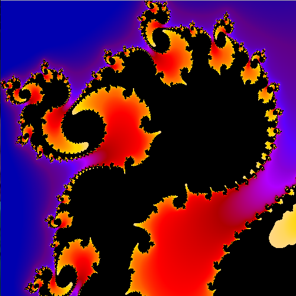
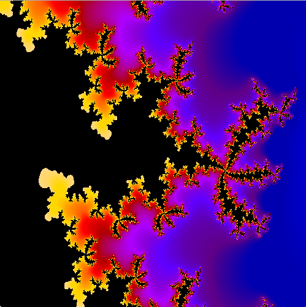

# mandelbrot

An interactive mandelbrot set viewer for terminal

## Installation
```bash
git clone https://github.com/k-vernooy/mandelbrot
cd mandelbrot
make && make install
```

## Usage

To run after installation, the `mandelbrot` command will start the interface. Controls are as follows:
- <kbd>arrows</kbd> - move in any direction
- <kbd>i</kbd> and <kbd>o</kbd>- zoom in/out
- <kbd>r</kbd> - reset view to initial coordinates
- <kbd>d</kbd> - draw current frame to an SDL window

*To be completed* - a vim-style interface for saving/loading positions and generating images/color schemes

## Dependencies
This will likely work on macOS and linux, provided the following dependencies are installed:
- [SDL2](https://www.libsdl.org/download-2.0.php)
- [ncurses](https://invisible-island.net/ncurses/)


## Demo
Images captured through use of `mandelbrot`  
### Ascii
Images from the terminal interface   
<center>

</center>

### Renders
Images taken through the gui window

<center>


</center>


## TODO
- Better color management
- Double (or possibly quadruple?) resolution with half/quarter blocks
